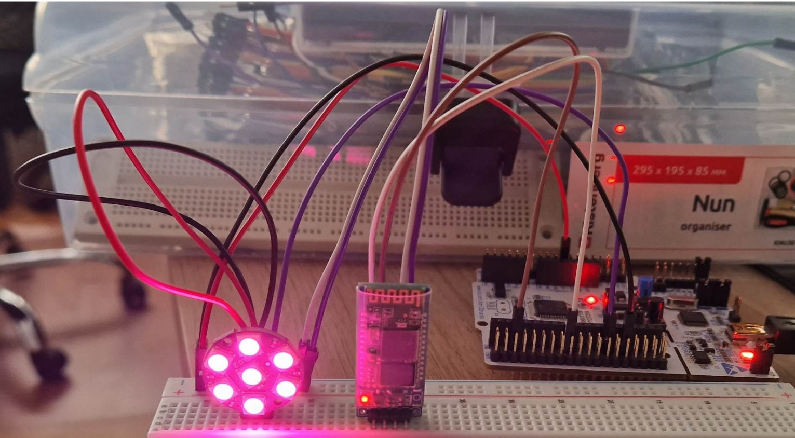
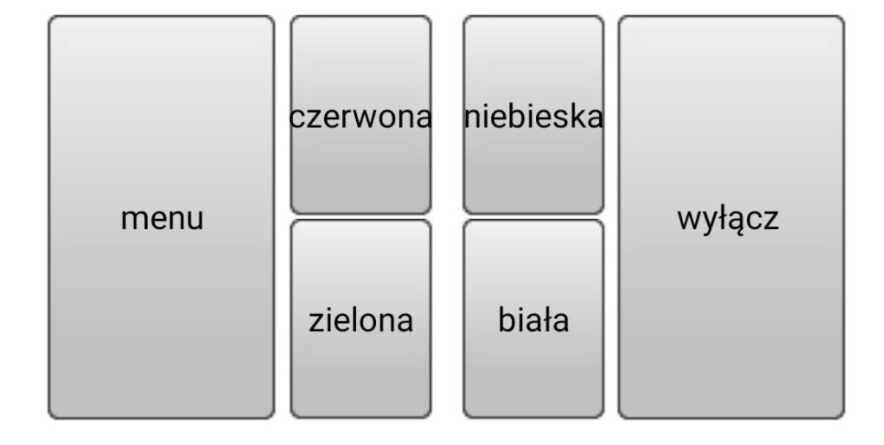

# STM32 WS2812B LED Controller (UART + Bluetooth)

Embedded project using STM32 (NUCLEO-L476RG) to control WS2812B LEDs via Bluetooth communication.

---

## Project Overview

This project implements a **wireless LED control system** based on the STM32 microcontroller and WS2812B addressable LEDs.

A mobile phone communicates with the system via a Bluetooth module (HC-06), allowing real-time control of LED colors.

The project combines:

- embedded programming (STM32)
- communication (UART + Bluetooth)
- hardware control (WS2812B LEDs)

---

## Hardware

- STM32 NUCLEO-L476RG
- WS2812B LED module / strip
- Bluetooth module HC-06
- Breadboard + wiring

---

## System Architecture

- STM32 generates precise timing signals for WS2812B LEDs
- HC-06 module enables wireless communication (UART)
- Mobile application sends commands to STM32

Based on project documentation

---

## Communication

- Interface: **UART**
- Wireless module: **HC-06 Bluetooth**
- Communication type: **Serial commands**

Flow:

```
Phone → Bluetooth → HC-06 → UART → STM32 → LED strip
```

---

## WS2812B Protocol

Each LED is controlled using a **24-bit frame**:

- 8 bits → Green
- 8 bits → Red
- 8 bits → Blue

Transmission order: **GRB**

Data characteristics:

- MSB first
- strict timing required

Signal encoding:

- `0` → short HIGH pulse
- `1` → long HIGH pulse
- `RESET` → LOW > 50 µs

---

## How It Works

1. User pairs phone with HC-06 module
2. Mobile app sends command (color selection)
3. STM32 receives data via UART
4. Data is converted to WS2812B format
5. LEDs display selected color

---

## Mobile App Features

The mobile interface allows:

- selecting LED color:

  - Red
  - Blue
  - Green
  - White
- turning LEDs ON/OFF

The app sends commands that directly control LED output.

---

## Software

### STM32 (C / HAL / CubeIDE)

- UART communication
- WS2812B driver implementation
- precise timing signal generation
- LED control logic

---

## Demo

### Hardware Setup (STM32 + WS2812B + Bluetooth)



STM32 connected to WS2812B LED module and HC-06 Bluetooth module.

---

### Mobile Application (Bluetooth Control)



Simple mobile interface used to control LED colors.

---

## Features

- wireless LED control via Bluetooth
- real-time color switching
- embedded + mobile integration
- simple and extendable system

---

## How to Run

1. Open project in **STM32CubeIDE**
2. Build the project
3. Flash firmware to STM32 board
4. Pair phone with HC-06 Bluetooth module
5. Use mobile app to control LEDs

---

## Possible Improvements

- LED animations (rainbow, effects)
- brightness control
- BLE instead of HC-06
- custom mobile app
- multiple LED patterns

---

## Author

Hubert Jabłoński
